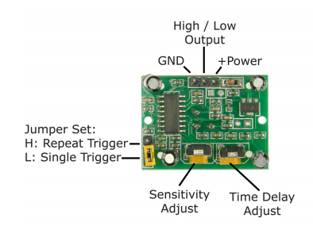

When you first connect your PIR sensor, you need to wait for about a minute before trying to detect motion.

There are three ways in which you can tune and adjust a PIR sensor.

### Sensitivity
- You can adjust the PIR sensor's sensitivity so that it picks up motion at different distances. Turn the potentiometer fully clockwise, and the sensor will detect motion up that's to about 3 metres away. Turn the potentiometer fully anti-clockwise, and the sensor will detect motion that's up to about 7 metres away.

### Delay time
- The delay time is the amount of time that the PIR sensor send signals to the Pi for once it is triggered. This is adjustable from about 3 seconds up to about 300 seconds. It will probably best if you turn this potentiometer fully anti-clockwise to keep the delay time as short as possible.

### Trigger jumper
- The trigger jumper is a small metal and plastic rectangle that can be removed and placed over a set of three pins.
- The trigger jumper can be set to two positions. In the diagram above, it is set to **single trigger** mode. This means that the PIR sensor will send signals when it detects motion, but will not signal again if it detects motion again within the delay time.
- If you move the jumper, it will be set to **repeat trigger** mode. In this mode, the PIR sensor sends signals when it is triggered, and if it detects motion again within the delay time, it will signal the Pi again, and the delay time will be reset.
- Usually, you will want to use the PIR sensor in **repeat trigger** mode.
